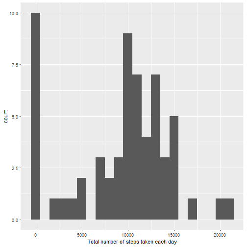
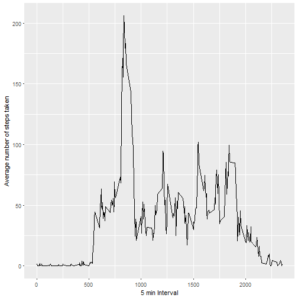
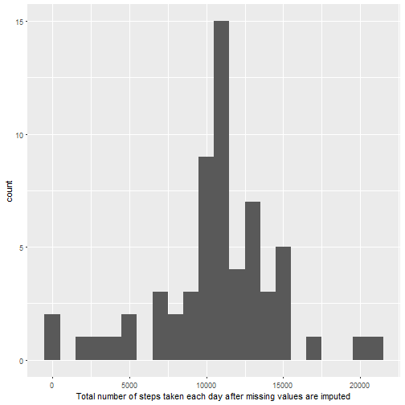
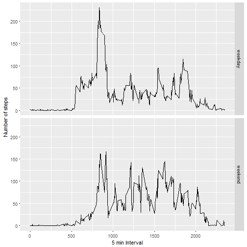

# Reproducible Research: Peer Assessment 1

## Loading and preprocessing the d1ata
Code for reading in the dataset and/or processing the data

```r
activity <- read.csv("activity.csv")
```

## What is mean total number of steps taken per day?
Histogram of the total number of steps taken each day

```r
library(ggplot2)
totalSteps <- tapply(activity$steps, activity$date, FUN = sum, na.rm = TRUE)
qplot(totalSteps, binwidth = 1000, xlab = "Total number of steps taken each day")
```



Mean and median number of steps taken each day

```r
mean(totalSteps, na.rm = TRUE)
```

```
## [1] 9354.23
```

```r
median(totalSteps, na.rm = TRUE)
```

```
## [1] 10395
```

## What is the average daily activity pattern?
Time series plot of the average number of steps taken

```r
averages <- aggregate(x = list(steps = activity$steps), by = list(interval = activity$interval), FUN = mean, na.rm = TRUE)
ggplot(data = averages, aes(x = interval, y = steps)) + geom_line() + xlab("5 min Interval") + ylab("Average number of steps taken")
```



The 5-minute interval that, on average, contains the maximum number of steps

```r
averages[which.max(averages$steps),]
```

```
##     interval    steps
## 104      835 206.1698
```

## Imputing missing values
Code to describe and show a strategy for imputing missing data

```r
missing_data <- is.na(activity$steps)
table(missing_data)
```

```
## missing_data
## FALSE  TRUE 
## 15264  2304
```

Histogram of the total number of steps taken each day after missing values are imputed

```r
imputing <- function(steps, interval) {
    updateActivity <- NA
	# if not missing, keep as it is; else, fill it up!
    if (!is.na(steps))
        updateActivity <- c(steps)
    else
        updateActivity <- (averages[averages$interval==interval, "steps"])
    return(updateActivity)
}
newActivity <- activity
newActivity$steps <- mapply(imputing, newActivity$steps, newActivity$interval)
totalSteps <- tapply(newActivity$steps, newActivity$date, FUN = sum, na.rm = FALSE)
qplot(totalSteps, binwidth = 1000, xlab = "Total number of steps taken each day after missing values are imputed")
```


Panel plot comparing the average number of steps taken per 5-minute interval across weekdays and weekends

```r
checkDay <- function(date) {
    day <- weekdays(date)
    if (day %in% c("Monday", "Tuesday", "Wednesday", "Thursday", "Friday"))
        return("weekday")
    else
        return("weekend")
}
newActivity$date <- as.Date(newActivity$date)
newActivity$day  <-  sapply(newActivity$date, FUN = checkDay)

averages <- aggregate(steps ~ interval + day, data = newActivity, mean)
ggplot(averages, aes(interval, steps)) + geom_line() + facet_grid(day ~ .) + xlab("5 min Interval") + ylab("Number of steps")
```


